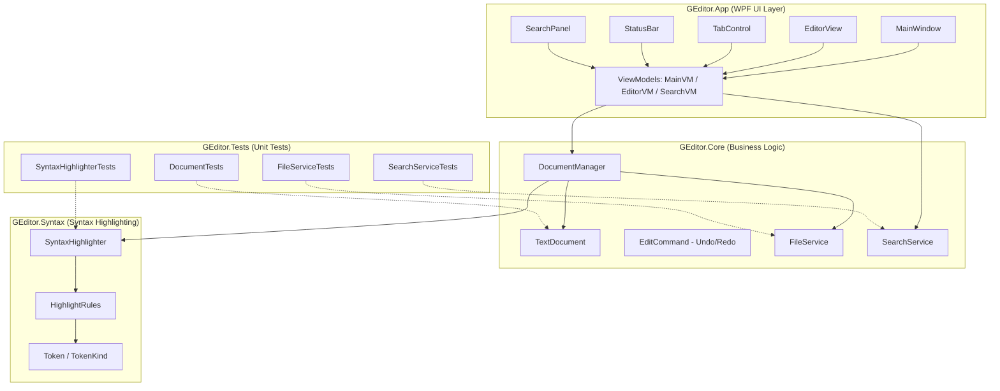

## Product Overview

G-editor 是一款轻量级桌面文本编辑器，使用 C# + .NET 8 + WPF 从零构建，采用 MIT 许可证。强调模块化、可测试性和渐进式迭代开发。

## Core Features

- **文件操作**: 新建、打开、保存、另存为；BOM 优先检测，默认 UTF-8 无 BOM 读写
- **多标签页**: 支持同时打开多个文档，标签页切换
- **文本编辑**: 行号显示、当前行高亮、自动缩进、撤销/重做
- **查找替换**: 支持正则表达式的查找与替换功能
- **状态栏**: 显示光标位置、编码、换行符类型、文件类型等信息
- **语法高亮**: 支持 2-3 种语言的基础语法高亮（如 C#、JSON、XML）
- **换行符处理**: 读入时识别 CRLF/LF/CR，内部统一处理，保存时保留原风格并可切换
- **架构分层**: GEditor.App(UI层)、GEditor.Core(文档模型/编辑核心/文件IO)、GEditor.Syntax(语法高亮)、GEditor.Tests(单元测试)，核心层不依赖 UI

## Tech Stack

- **语言**: C# 12 / .NET 8
- **UI 框架**: WPF (.NET 8)
- **单元测试**: xUnit + Moq
- **构建工具**: .NET CLI / Visual Studio Solution
- **许可证**: MIT License

## Implementation Approach

采用**分层架构 + MVVM 模式**实现。GEditor.Core 和 GEditor.Syntax 作为纯逻辑库，完全不依赖 WPF/UI，通过接口和事件与 UI 层解耦。GEditor.App 作为 WPF 宿主，通过 MVVM 绑定消费核心层服务。

关键决策：

- **文档模型与 UI 分离**: `TextDocument` 模拟文档数据结构（文本内容、编码、换行符等），编辑操作通过命令模式实现 undo/redo，UI 层仅负责渲染和用户输入转发
- **文件 IO 独立模块**: `FileService` 负责编码检测、BOM 处理、换行符转换，不依赖任何 UI 组件
- **语法高亮可扩展**: `SyntaxHighlighter` 基于 Token 分类器设计，每种语言一个规则文件，UI 层消费 Token 列表进行着色
- **事件驱动通信**: Core 层通过 `event` 通知文档变更，UI 层订阅并响应，保持单向数据流
- **依赖注入**: 使用 Microsoft.Extensions.DependencyInjection 管理服务生命周期，便于测试时替换

性能考虑：

- 文档模型使用行数组存储，大文件（>1MB）采用虚拟化/分段加载策略
- 语法高亮采用增量解析，仅重新解析变更区域

## Architecture Design



## Directory Structure

```
G-editor/
├── GEditor.sln                          # [NEW] 解决方案文件，包含所有子项目引用
├── LICENSE                              # [NEW] MIT 许可证文件
├── README.md                            # [NEW] 项目说明文档
├── .gitignore                           # [NEW] Git 忽略规则
│
├── src/
│   ├── GEditor.Core/                    # [NEW] 核心逻辑库（无 UI 依赖）
│   │   ├── GEditor.Core.csproj          #   类库项目文件，引用无 UI 包
│   │   ├── Documents/
│   │   │   ├── TextDocument.cs          #   [SKELETON] 文档模型：存储文本行、编码、换行符类型、修改状态
│   │   │   ├── DocumentChangedEventArgs.cs  # [SKELETON] 文档变更事件参数
│   │   │   └── NewLineMode.cs           #   [SKELETON] 换行符枚举（CRLF/LF/CR/Unknown）
│   │   ├── Editing/
│   │   │   ├── IEditCommand.cs          #   [SKELETON] 编辑命令接口（Execute/Undo/Redo）
│   │   │   ├── InsertTextCommand.cs     #   [SKELETON] 插入文本命令实现
│   │   │   ├── DeleteTextCommand.cs     #   [SKELETON] 删除文本命令实现
│   │   │   ├── ReplaceTextCommand.cs    #   [SKELETON] 替换文本命令实现
│   │   │   └── CommandHistory.cs        #   [SKELETON] 命令历史栈（Undo/Redo 管理）
│   │   ├── IO/
│   │   │   ├── IFileService.cs          #   [SKELETON] 文件服务接口（Open/Save/SaveAs）
│   │   │   ├── FileService.cs           #   [SKELETON] 文件服务实现（BOM 检测、编码处理）
│   │   │   ├── EncodingDetector.cs      #   [SKELETON] 编码检测器（BOM 优先 + 回退策略）
│   │   │   └── NewLineDetector.cs       #   [SKELETON] 换行符检测器（识别 CRLF/LF/CR）
│   │   ├── Search/
│   │   │   ├── ISearchService.cs        #   [SKELETON] 搜索服务接口
│   │   │   └── SearchService.cs         #   [SKELETON] 搜索/替换实现（支持正则）
│   │   └── Management/
│   │       ├── IDocumentManager.cs      #   [SKELETON] 文档管理器接口
│   │       └── DocumentManager.cs       #   [SKELETON] 文档生命周期管理（创建/打开/关闭）
│   │
│   ├── GEditor.Syntax/                  # [NEW] 语法高亮库（无 UI 依赖）
│   │   ├── GEditor.Syntax.csproj        #   类库项目文件
│   │   ├── ISyntaxHighlighter.cs        #   [SKELETON] 语法高亮接口
│   │   ├── SyntaxHighlighter.cs         #   [SKELETON] 高亮引擎（增量解析）
│   │   ├── Token.cs                     #   [SKELETON] Token 定义（类型、起始位置、长度）
│   │   ├── TokenKind.cs                 #   [SKELETON] Token 类型枚举（关键字/字符串/注释等）
│   │   └── Languages/
│   │       ├── CSharpHighlightRules.cs  #   [SKELETON] C# 语法规则
│   │       ├── JsonHighlightRules.cs    #   [SKELETON] JSON 语法规则
│   │       └── XmlHighlightRules.cs     #   [SKELETON] XML 语法规则
│   │
│   └── GEditor.App/                     # [NEW] WPF 应用层
│       ├── GEditor.App.csproj           #   WPF 应用项目文件，引用 Core + Syntax
│       ├── App.xaml / App.xaml.cs       #   WPF 应用入口，DI 容器初始化
│       ├── MainWindow.xaml / .xaml.cs   # [SKELETON] 主窗口（菜单栏、标签页、编辑区、状态栏）
│       ├── ViewModels/
│       │   ├── MainViewModel.cs         #   [SKELETON] 主窗口 ViewModel
│       │   ├── EditorViewModel.cs       #   [SKELETON] 编辑器 ViewModel（绑定 TextDocument）
│       │   └── SearchViewModel.cs       #   [SKELETON] 查找替换 ViewModel
│       ├── Views/
│       │   ├── EditorView.xaml / .xaml.cs   # [SKELETON] 编辑器视图（行号 + 文本区）
│       │   ├── StatusBarView.xaml / .xaml.cs # [SKELETON] 状态栏视图
│       │   └── SearchPanelView.xaml / .xaml.cs # [SKELETON] 查找替换面板
│       ├── Converters/
│       │   └── BoolToVisibilityConverter.cs  # 值转换器
│       ├── Services/
│       │   └── WpfDialogService.cs      # [SKELETON] WPF 对话框服务（打开/保存文件对话框）
│       └── Helpers/
│           └── ResourceDictionary.xaml   # [SKELETON] 全局样式资源
│
└── tests/
    └── GEditor.Tests/                   # [NEW] 单元测试项目
        ├── GEditor.Tests.csproj         #   测试项目文件，引用 Core + Syntax + xUnit
        ├── Documents/
        │   └── TextDocumentTests.cs     # [SKELETON] 文档模型单元测试
        ├── Editing/
        │   └── CommandHistoryTests.cs   # [SKELETON] Undo/Redo 单元测试
        ├── IO/
        │   ├── FileServiceTests.cs      # [SKELETON] 文件读写测试（编码、BOM、换行符）
        │   └── EncodingDetectorTests.cs # [SKELETON] 编码检测测试
        ├── Search/
        │   └── SearchServiceTests.cs    # [SKELETON] 搜索替换测试
        └── Syntax/
            └── SyntaxHighlighterTests.cs # [SKELETON] 语法高亮测试
```

## Key Code Structures

```
// GEditor.Core - 文档模型核心接口
public interface ITextDocument : IDisposable
{
    string FilePath { get; set; }
    bool IsDirty { get; }
    Encoding Encoding { get; set; }
    NewLineMode NewLineMode { get; set; }
    IReadOnlyList<string> Lines { get; }
    int LineCount { get; }
    event EventHandler<DocumentChangedEventArgs>? Changed;
    void InsertText(int line, int column, string text);
    void DeleteText(int line, int column, int length);
    string GetText(int startLine, int startCol, int endLine, int endCol);
    void SetText(string text);
}

// GEditor.Core - 编辑命令接口
public interface IEditCommand
{
    void Execute(ITextDocument document);
    void Undo(ITextDocument document);
    string Description { get; }
}

// GEditor.Syntax - 语法高亮接口
public interface ISyntaxHighlighter
{
    IReadOnlyList<Token> HighlightLine(string lineText, int lineNumber);
    IReadOnlyList<Token> HighlightDocument(IReadOnlyList<string> lines);
    string SupportedLanguage { get; }
}
```

## Implementation Notes

- Core 和 Syntax 项目**不引用任何 WPF 包**，确保完全可独立测试
- 所有骨架代码仅包含接口定义、类结构、属性签名和方法存根，方法体使用 `throw new NotImplementedException()`
- DI 注册在 App.xaml.cs 中集中管理，ViewModel 通过构造函数注入依赖
- 文件路径使用 `Path.GetFullPath` 规范化，避免路径问题
- 编码检测优先级：BOM 头 > UTF-8 启发式检测 > 系统默认编码回退

## Agent Extensions

- **code-explorer**
- Purpose: 在后续迭代实现中，用于跨模块搜索依赖关系和验证架构一致性
- Expected outcome: 确保各层接口实现正确、依赖方向无违规